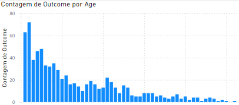
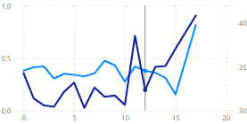
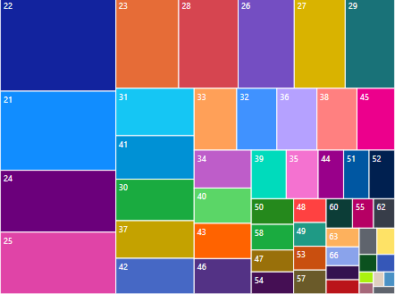

# Power BI

## Fundamentos de Business Intelligence (BI)

> Mercado de Data

****

**Engenheiro de dados**

- Desenho / Construção
- Sustentação das soluções de dados

Extração de dados de fontes heterogêneas, disponibilizar os dados para serem consumidos pelos analistas e cientistas

****

**Cientista de dados**

- Modelagem
- Reconhecimento de padrões / Predição

Busca responder perguntas atreladas ao contexto do negócio. Buscando insights através de técnicas de modelagem 

****

**Analista de dados**

- Criação de dashboards
- Apresentação visual dos dados

Busca entender o comportamento do negócio a partir dos dados. Realiza o diagnóstico, identifica possíveis motivos para o comportamento e verifica métricas 

****

## BI e sua matéria prima: Dados

> O que são dados

Eles são dados de certa forma não são nada sem tratamento,e com o tratamento adequado você pode extrair informação e conhecimento e estão organizados de arquivos 

- Dados: Não possuem valor - qualquer tipo de dados
- Informação: Representação do cenário
- Conhecimento: compreensão de um contexto

Então temos os dados que serão transformados em dados e esses dados serão tratados e transformados em informações, que vao gerar conhecimento de determinadas situações e ai usando a esse conhecimento junto com a inteligência podemos tomar decisões

## O que BI ( Business Intelligence )

"Business Intelligence (BI) consiste em uma área composta por estratégias e tecnologias utilizadas pelas empresas a fim de realizar análises de dados e gerenciamento das informações"

- Objetivo: Transformar dados em conhecimento
- Entendimento: Fatores conhecido e não conhecidos
- Foco: Operações e melhorias 

Ou seja a pessoa é responsável por aumentar os lucros da empresa e torna-la mais competitiva no mercado contra seus concorrentes mas como ele faz isso?

> Relatórios 

Exemplos:

- Comportamento de clientes
- Monitoramento de ativos
- Previsibilidade de vendas

> Métricas

As métricas são medidas quantificáveis usadas para analisar a evolução e o resultado de um processo, ação ou estratégia específica. Dessa forma, elas precisam ser quantificáveis e mensuráveis. Ou seja, traduzindo em uma linguagem clara, são informações que precisam ser de fácil entendimento e que, a partir delas, gestores e líderes possam ser capazes de realizar um plano de ação para melhorá-los. 

**Exemplos**:

- Receita recorrente
- Produtividade
- Margem bruta de lucro
- Retorno sobre o investimento
- Número total de clientes
- Etc...

No caso você pode realizar a combinação de métricas que são independentes e que consiga fazer essa combinação e fique coerente e que o cliente consiga entender

> Futuro do BI

- Diferente escopo
- Variedade dos dados
- Especificidade
- Granularidade de dados

Ou seja pegar dados de diferentes escopos e com variedade de dados e cada um com sua especificidade e granularidade de dados distintas e essa granularidade está relacionada ao formato do dado, e o futuro do BI é pegar essas informações e logicamente elas vão ser tratadas adequadamente e usando as técnicas de IA e com isso nós conseguimos encontrar diversas informações, e fazendo tudo isso com o paradigma do **BIG DATA** associado, ok !, mas o que isso muda?

Em questão da apresentação e expor as informações ? NADA, agora como você coleta as informações muda tudo, agora ao invés de você estar usando o power BI para para coletar os dados do banco de dados você pode estar integrando uma ferramenta de Big Data para coletar os dados 

> Softwares de BI

- Orquestração
- Recuperação de dados
- Integração
- Relatórios de visualização

**Exemplos**:

- Power BI
- Tableau
- Banco de dados

> Big data

- Volume
- Variedade
- Velocidade
- Veracidade

> BI

- Dados típicos
- Maioria das empresas
- Baixo volume de dados

## Tipos de Análises em BI

- Descritiva
  - Primeira análise
  - Caracterizar, sumarizar
  - Entender: Comportamento dos dados
- Diagnóstica 
  - Encontrar relações de causa e efeito no cenário descrito pelos dados
  - Processo probabilístico (probabilidade de partir desses dados que você encontrou ter uma causa e efeito )
- Preditiva
  - Data science
  - Tentar prever um cenário
  - Probabilidade
  - Análise de Tendências
- Prescritivo
  - Data science
  - Diagnóstico e Prescrição
  - Resolução de um problema
  - Subsídio dos impactos

> Como aplicar BI

- Coleta das informações 
- Estruturação ( Transformação )
- Representação visual ( relatórios, gráficos ...)

> Respeite o processo

- Problema de negócio
- Perguntas sobre o contexto
- Escolha o tipo de análise
- Utilize as Ferramentas

> Perguntas que cada análise faz

- Descritiva -> **"O que aconteceu ?"**
- Diagnóstica -> **"Por que aconteceu ?"**
- Preditiva -> **"O que vai acontecer ?"**
- Prescritivo -> **"O que fazer ?"**

## Análise de dados e Big Data

> Contextualizando 

- Variedade e quantidade
- Dados não estruturados
- Permite alterar com mais facilidade os dados

> Passo a passo para chegar na análise
- Data source ( Fonte de dados )
- ETL
- Data Warehouse
- Análise de dados
- Visualização dos dados
## Regressão linear

## Análise de dados com SQL

- Linguagem de consulta a banco de dados sem um banco de dados ela meio que não existe sozinha 
- Estrutura tabular 

### Como vamos trabalhar com SQL

**Plano de Estudo**

- Cenário do mundo real
- Situação com problema de negócios
- Escolha da abordagem ( análise ) 

## O que fazer em um primeiro contato com base de dados?

- Usando o DBeaver é bem util para ver as relações das tabelas e ele monta uma visualização para poder analisar 

"""Existem boas práticas na consulta de dados a SGBDs de produção que possuem milhares de linhas. Dentre elas, não travar o banco de dados é um dos pontos de atenção. Sendo assim, qual das cláusulas é utilizada para este fim?"""

## ETL ( Extract, Transform and Load )

> O que é 

Um conceito ( pipeline de dados ) em análise de dados que se baseia em:

- Extrair os dados, pode ser pegos através de uma API ou até mesmo através de um web scrapping com python
- Transforma-las para que seja algo útil, pegar os dados em uma determinada estrutura e passa-los para uma outra estrutura mais condinzente para o que você precisa
  - Limpeza ( Clean ) dos dados
- E depois carregar em algum repositório, integração dos dados sendo enviado para um ambiente centralizado de forma que ele fique disponível para os demais usuários da área de dados poderem usar
  - Análise

## ELT Extract, Load and Transform 

Aqui tem uma simples diferença para o ETL é que o ELT carrega antes os dados para depois transforma-los

**Mas por que fazer isso?**

Facilita na manipulação dos dados pois no ETL quando você faz a transformação antes você meio que cria um molde de que os dados irão seguir ou seja eles não podem fugir desse molde e ai dificulta um pouco em algumas manipulações, ja no ELT que carrega antes os dados permite que so depois você transforme facilitando a manipulação e edição desses dados, entretanto usar o método ELT é mais complexo e mais demorado

> Processo de Extração de Dados - ELT

- Coleta de dados brutos
- Fontes heterogêneas
- Objetivo: Integração posterior

> Transform

- Transformação dos dados dentro do repositório 
- Aplicação das análises

> Vantagens

- Contato direto com regras de negócios
- Otimização de tempo
- Eficiência na implementação de projetos
- Menor dependência de TI
- Papel Principal dos analistas
- Tempo de carregamento 
- Tempo de Manutenção
- Complexidade de implementação

## Diferenças entre ETL e ELT

- O ELT carrega os dados mais rápido
- O ELT tem um tempo menor a transformação de dados
- O ELT tem menor custo e tempo na manutenção

## O que é Power BI

- Ele preenche a lacuna entre os dados e a tomada de decisão

Então de certa forma ele permite que você crie **Análise descritivas**, **Relatórios** e **Dashboards**

## Análise de dados com Power BI

### Inteligencia de Negócios 

Aqui estão os blocos de construção básicos no Power BI

- Visualizações
- Conjuntos de dados
- Relatórios 
- Painéis
- Blocos

### Gráficos 

> Gráfico de barras

Muito utilizado para mostrar agrupamento de dados

> Linha

Usado para ver tendencias ao longo do tempo

> Treemap

Usada para visualizar dados, quando maior o retângulo, maior o valor numérico dele. Treemaps pode responder perguntas sobre seus dados como, Quais são as proporções de categorias para o total?

> Funil

- Usado quando se tem uma base de dados pequena

> Gráfico de dispersão

- Serve para exibir muitos dados relacionados em um gráfico. Em gráficos de dispersão, o eixo x exibe um campo numérico e o eixo y exibe outro, facilitando a visualização da relação entre os dois valores de todos os itens do gráfico.

> Dica de ferramenta